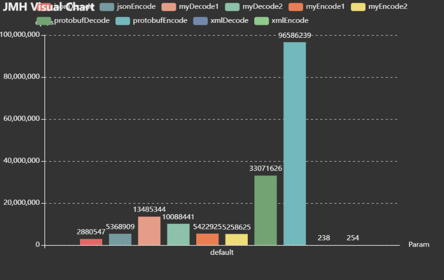

# protocolFish

an net protocol for iot based on netty

## protocol header struct (bit position is from left to right)

header length 4 byte

### plain header

| bit position | size   | meaning
--------------|--------|-----------
| 1               | 1 bit  | shake hand
| 2               | 1 bit  |  data message
| 3               | 1 bit    |  acknowledge

### shake hand header

| bit position | size  | meaning
--------------|-------|-----------
| 4            | 1 bit | enable double compression
| 5            | 4 bit | double compression accuracy
| 9            | 2 bit | variable data head length (just for codec1)
| 11           | 3 bit | string charset
| 14           | 1 bit | enable base line compression
| 16           | 17 bit | magic number: 11011111101010010

### data message header

| bit position | size   | meaning
--------------|--------|-----------
| 3            | 1 bit  | need acknowledge
| 7            | 10 bit | data class identity
| 17           | 16 bit  | sequence number

### ack message header
| bit position | size   | meaning
--------------|--------|-----------
| 17           | 16 bit  | sequence number

## body codec benchmark

### test entity

```java

@XmlRootElement
public class IotSimpleEntity {

    public long deviceId;

    public long geoHash;

    public long timestamp;

    public int intValue1;

    public int intValue2;

    public long longValue1;

    public long longValue2;

    public double doubleValue1;

    public double doubleValue2;

    public String stringValue1;

}
```

### encode and decode rate

benchmark code
file (https://github.com/A-Salty-Fish/protocolFish/blob/main/src/main/java/benchmark/EncodeBenchmark.java)

benchmark result file (https://github.com/A-Salty-Fish/protocolFish/blob/main/jmh-encode-with-baseLine.json)

benchmark result chart:   


faster than json and xml, but slower than protobuf

### compression rate

compression code
file (https://github.com/A-Salty-Fish/protocolFish/blob/main/src/main/java/benchmark/TestCompressionRate.java)

#### without special compression config:

| strategy      | size   |
   |--------| ----------- |
|myLength1    | 287951 |  
|myLength2    | 286755 |  
|protobufLength    | 289273 |  
|jsonLength:    | 499904 |  
|xmlLength:    | 729904 |  

close to protobuf(my protobuf count code has data deviation about 1 % more than exact)

#### with double compression config (it will cut decimal point, here use 2):

| strategy      | size   |
   |--------| ----------- |
|myLength1    |284636|
|myLength2    |283584|
|protobufLength    | 289372|
|jsonLength:    |500078|
|xmlLength:    |730078|

still close to protobuf(less than default)

#### with baseLine compression config (it will xor with baseLine value, here assume that the value just change little):

| strategy      | size   |
   |--------| ----------- |
|myLength1    |74205|
|myLength2    |64684|
|protobufLength    | 133297|
|jsonLength:    |512489|
|xmlLength:    |1005412|

now just half of the protobuf size.

## todo

1. self-adaption baseLine change;
2. protocol image

## reference

1. Gorilla: a fast, scalable, in-memory time series database (https://dl.acm.org/doi/10.14778/2824032.2824078)
2. Netty (https://netty.io/)