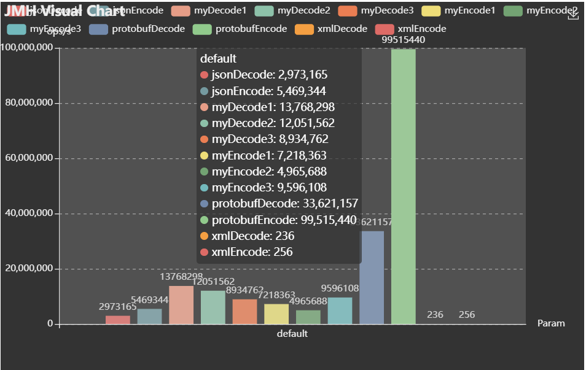

# protocolFish

an net protocol for iot based on netty

## protocol header struct (bit position is from left to right)

header length 4 byte

### plain header

| bit position | size   | meaning
--------------|--------|-----------
| 1               | 1 bit  | shake hand
| 2               | 1 bit  |  data message
| 3               | 1 bit    |  acknowledge

### shake hand header

| bit position | size  | meaning
--------------|-------|-----------
| 4            | 1 bit | enable double compression
| 5            | 4 bit | double compression accuracy
| 9            | 2 bit | variable data head length (just for codec1)
| 11           | 3 bit | string charset
| 14           | 1 bit | enable base line compression
| 16           | 17 bit | magic number: 11011111101010010

### data message header

| bit position | size   | meaning
--------------|--------|-----------
| 3            | 1 bit  | need acknowledge
| 7            | 10 bit | data class identity
| 17           | 16 bit  | sequence number

### ack message header
| bit position | size   | meaning
--------------|--------|-----------
| 17           | 16 bit  | sequence number

## body codec benchmark

### test entity

```java

@XmlRootElement
public class IotSimpleEntity {

    public long deviceId;

    public long geoHash;

    public long timestamp;

    public int intValue1;

    public int intValue2;

    public long longValue1;

    public long longValue2;

    public double doubleValue1;

    public double doubleValue2;

    public String stringValue1;

}
```

### encode and decode rate

benchmark code
file (https://github.com/A-Salty-Fish/protocolFish/blob/main/src/main/java/benchmark/EncodeBenchmark.java)

benchmark result file (https://github.com/A-Salty-Fish/protocolFish/blob/main/jmh-encode-decode.json)

benchmark result chart:   


1 is bit operation based on byte array  
2 is byte array operation  
3 is byte stream operation  

1 has the most compact struct and has the best decode performance, while its encode is slower than 3.  
2 and 3 has the same struct, so we can use any of them to encode and decode.  
So the best choice is use 2 to decode and 3 to encode.  

### compression rate with random datasets (2 is the same as 3)

compression code
file (https://github.com/A-Salty-Fish/protocolFish/blob/main/src/main/java/benchmark/TestCompressionRate.java)

#### without special compression config:

| strategy      | size   |
   |--------| ----------- |
|myLength1    | 287951 |  
|myLength2    | 286755 |  
|protobufLength    | 289273 |  
|jsonLength:    | 499904 |  
|xmlLength:    | 729904 |  

close to protobuf(my protobuf count code has data deviation about 1 % more than exact)

#### with double compression config (it will cut decimal point, here use 2):

| strategy      | size   |
   |--------| ----------- |
|myLength1    |284636|
|myLength2    |283584|
|protobufLength    | 289372|
|jsonLength:    |500078|
|xmlLength:    |730078|

still close to protobuf(less than default)

#### with baseLine compression config (it will xor with baseLine value, here assume that the value just change little):

| strategy      | size   |
   |--------| ----------- |
|myLength1    |74205|
|myLength2    |64684|
|protobufLength    | 133297|
|jsonLength:    |512489|
|xmlLength:    |1005412|

now just half of the protobuf size.

### with baseLine compression config and different string length

[the result xlsx file](./data/string%20length.xlsx)

| string length |  my / protobuf   |  my / json
---------------|--------| ----------- |
| 128           | 72.40% | 32.94%
| 64            | 58.59% | 20.95%
| 32            | 43.75% | 12.88%
| 16:           | 32.50% | 8.39%
| 8:            | 25.00% | 5.96%
| 4:            | 20.59% | 4.70%
| 2:            | 18.18% | 4.05%
| 1:            | 16.92% | 3.73%
| 0:            | 15.63% | 3.40%

### compression rate with true datasets

dataset: (https://www.kaggle.com/datasets/taranvee/smart-home-dataset-with-weather-information)  
step means that how often the baseLine object is changed.

1. with default config

| my1 |  my2 | protobuf | json |
|-----| ----------- | ------| ------|
|121064130	|130036072	|143080950	|324611758

2. only with baseLine compression config

| step  | my1 |  my2 | protobuf | json |
-----|-----| ----------- | ------| ------|
|1	|75561590	|76182146	|143080950	|324611758
|5	|77629790	|78618394	|143080950	|324611758
|10	|79395562	|80710335	|143080950	|324611758
|15	|80880040	|82490918	|143080950	|324611758
|20	|82001410	|83839161	|143080950	|324611758
|25	|83268607	|85375226	|143080950	|324611758
|30	|84295644	|86616991	|143080950	|324611758
|35	|85439474	|88006593	|143080950	|324611758
|40	|86363743	|89104907	|143080950	|324611758
|45	|87447910	|90438766	|143080950	|324611758
|50	|88340404	|91517075	|143080950	|324611758
|100	|94607809	|99054739	|143080950	|324611758
|150	|97126084	|102066823	|143080950	|324611758
|200	|98710913	|103920615	|143080950	|324611758
|250	|99726654	|105124086	|143080950	|324611758
|300	|100491054	|106015333	|143080950	|324611758
|350	|101124657	|106756824	|143080950	|324611758
|400	|101628248	|107342679	|143080950	|324611758
|450	|102008752	|107808241	|143080950	|324611758
|500	|102322578	|108211720	|143080950	|324611758
|550	|102600745	|108539473	|143080950	|324611758
|600	|102854262	|108854779	|143080950	|324611758
|650	|103167669	|109254817	|143080950	|324611758
|700	|103262884	|109378536	|143080950	|324611758
|750	|103618351	|109831540	|143080950	|324611758
|800	|103709455	|109892126	|143080950	|324611758
|850	|103881509	|110158473	|143080950	|324611758
|900	|103927079	|110190853	|143080950	|324611758
|950	|103922755	|110203036	|143080950	|324611758
|1000	|104101006	|110397522	|143080950	|324611758

3. with baseLine and double compression(accuracy level: 4)

| step  | my1 |  my2 | protobuf | json |
-----|-----| ----------- | ------| ------|
|1	|34307307	|27942074	|143080950	|324611758
|5	|34785349	|28642154	|143080950	|324611758
|10	|35160927	|29145692	|143080950	|324611758
|15	|35483154	|29584544	|143080950	|324611758
|20	|35733103	|29908195	|143080950	|324611758
|25	|36013121	|30302323	|143080950	|324611758
|30	|36233259	|30596901	|143080950	|324611758
|35	|36489835	|30961407	|143080950	|324611758
|40	|36686073	|31215323	|143080950	|324611758
|45	|36918355	|31571542	|143080950	|324611758
|50	|37111442	|31843995	|143080950	|324611758
|100	|38471591	|33800657	|143080950	|324611758
|150	|39129969	|34641685	|143080950	|324611758
|200	|39577545	|35160405	|143080950	|324611758
|250	|39904458	|35517728	|143080950	|324611758
|300	|40189986	|35795860	|143080950	|324611758
|350	|40398418	|35986582	|143080950	|324611758
|400	|40586325	|36179793	|143080950	|324611758
|450	|40763808	|36329498	|143080950	|324611758
|500	|40893746	|36483963	|143080950	|324611758
|550	|41005943	|36603133	|143080950	|324611758
|600	|41106297	|36710039	|143080950	|324611758
|650	|41244807	|36828152	|143080950	|324611758
|700	|41255771	|36832040	|143080950	|324611758
|750	|41408905	|36985822	|143080950	|324611758
|800	|41433145	|36991171	|143080950	|324611758
|850	|41541166	|37122710	|143080950	|324611758
|900	|41574564	|37141611	|143080950	|324611758
|950	|41611340	|37165065	|143080950	|324611758
|1000	|41678344	|37227629	|143080950	|324611758

Process finished with exit code 0


Process finished with exit code 0

## todo

1. self-adaption baseLine change;
2. protocol image

## reference

1. Gorilla: a fast, scalable, in-memory time series database (https://dl.acm.org/doi/10.14778/2824032.2824078)
2. Netty (https://netty.io/)
